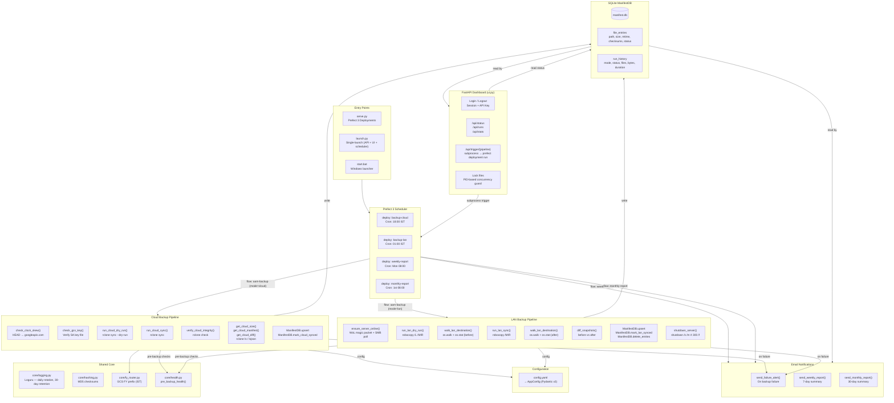

# AAM Backup Automation V1 — Architecture

## Overview

AAM Backup Automation V1 is a **dual-destination backup tool** for Windows Server 2016. It synchronizes a local source drive to two independent targets — a LAN share (via `robocopy /MIR`) and Google Cloud Storage (via `rclone sync`) — orchestrated by **Prefect 3** on a cron schedule, with a **FastAPI dashboard** for manual triggers and status, **SQLite** for file catalog and run history, and **email notifications** for failure alerts and periodic summaries.

### Design Principles

- **The filesystem is the truth** — no scanner, no log parsing. `os.walk` + `os.stat` for inventory.
- **Single-server deployment** — the backup source machine runs everything (Prefect serve + dashboard + subprocesses).
- **Idempotent operations** — each run opens a fresh DB connection, does its work, and closes.
- **Retry with backoff** — both cloud and LAN pipelines have flow-level retry loops with configurable attempt count and delay.
- **Safe by default** — lock files prevent concurrent pipeline runs; dry-runs validate paths before real sync.

---

## Directory Layout

```
├── flow.py              # Prefect 3 flow definitions (backup, reports)
├── serve.py              # Prefect 3 deployment registration + schedules
├── launch.py             # Single-launch script (Prefect API + dashboard + scheduler)
├── ui.py                 # FastAPI dashboard (578 lines)
├── models/
│   ├── config.py         # Pydantic v2 configuration model
│   └── __init__.py
├── core/                 # Domain logic (17 files, 1,626 lines)
│   ├── cloud_sync.py     # rclone sync → GCS
│   ├── cloud_preflight.py# rclone dry-run preflight
│   ├── cloud_verify.py   # rclone check integrity
│   ├── cloud_reporter.py # rclone ls/json queries
│   ├── lan_sync.py       # robocopy /MIR wrapper
│   ├── lan_preflight.py  # robocopy /L dry-run
│   ├── lan_manifest.py   # OS walk + stat + diff
│   ├── health.py         # Pre-backup health checks
│   ├── manifest.py       # SQLite ManifestDB (315 lines)
│   ├── report.py         # Email notifications
│   ├── wol.py            # Wake-on-LAN
│   ├── shutdown.py       # Remote shutdown
│   ├── hashing.py        # MD5 checksums
│   ├── fy_router.py      # GCS FY prefix (IST)
│   ├── logging.py        # Loguru configuration
│   ├── rclone_config.py  # Temp rclone config file
│   └── subprocess_util.py# Shared subprocess helpers
├── tests/                # Pytest tests
├── config.yaml           # Runtime configuration
├── pyproject.toml        # Python project metadata
└── start.bat             # Windows batch launcher
```

---

## Functional Areas

### 1. Configuration Layer (`models/config.py`)
Pydantic v2 models for **all** configuration: paths, LAN, cloud, WoL, notifications, dashboard auth, schedules. Validated on load from `config.yaml`. Cross-field validation ensures consistency (e.g., `lan_destination` must be UNC when LAN is enabled).

**Key models:** `AppConfig`, `PathsConfig`, `LanConfig`, `CloudConfig`, `WolConfig`, `NotificationConfig`, `DashboardConfig`, `ScheduleConfig`

### 2. Prefect Orchestration Layer (`flow.py`, `serve.py`)
Three Prefect flows defined in `flow.py`:
- **`aam-backup`** — main backup orchestrator (mode: `cloud`, `lan`, or `all`)
- **`weekly-report`** — weekly summary email
- **`monthly-report`** — monthly summary email

Four deployments registered in `serve.py` via `prefect serve`:
| Deployment | Schedule (IST) | Function |
|---|---|---|
| `backup-cloud` | Daily 18:00 | Cloud backup (rclone → GCS) |
| `backup-lan` | Daily 01:00 | LAN backup (robocopy /MIR + WoL + shutdown) |
| `weekly-report` | Mon 08:00 | Weekly summary email |
| `monthly-report` | 1st 08:00 | Monthly summary email |

`launch.py` provides a single-entry-point that starts Prefect API server (subprocess), dashboard (thread), and scheduler (main thread) in one command.

### 3. Cloud Backup Pipeline (`core/cloud_*`)
Sequential stages within `cloud_backup_task()`:
1. **Clock skew check** — HEAD request to `www.googleapis.com`, compares `Date` header to local UTC
2. **GCS key check** — verifies service account key file exists and is non-empty
3. **Preflight dry-run** — `rclone sync --dry-run` validates paths, permissions, and bucket accessibility
4. **Sync** — `rclone sync` with configurable bandwidth limit, retries, transfers, and checkers
5. **Verify** — `rclone check` post-sync integrity verification
6. **Report** — `rclone ls / lsjson` for file count, size, and manifest diff
7. **DB upsert** — writes file entries and run history to `ManifestDB`

Failures trigger up to `max_attempts` (default 3) retries with `retry_delay_seconds` (default 300s) between attempts.

### 4. LAN Backup Pipeline (`core/lan_*`)
Sequential stages within `lan_backup_task()`:
1. **Wake-on-LAN** — sends magic packet to server MAC, polls SMB port 445 until online
2. **Preflight dry-run** — `robocopy /L /MIR /XJ` validates UNC path and permissions
3. **Pre-sync manifest** — `os.walk` + `os.stat` of destination share → `snapshot_to_dict`
4. **Sync** — `robocopy /MIR` with configurable threads, retries, and wait
5. **Post-sync manifest** — second walk → `diff_snapshots` for added/removed/modified
6. **DB upsert** — writes file entries, marks synced paths, deletes removed entries
7. **Shutdown** — optional remote shutdown via `shutdown /s /m \\\\IP /t 300 /f`

Failures trigger up to `max_attempts` (default 2) retries with `retry_delay_seconds` (default 600s).

### 5. Dashboard UI (`ui.py`)
FastAPI application with:
- **Auth** — session-based (24h TTL) + `X-API-Key` header fallback, `hmac.compare_digest`
- **Pages** — login, dashboard (run history, trigger buttons), status
- **Triggers** — fires `prefect deployment run` via subprocess
- **Lock system** — PID-based lock files prevent concurrent pipeline runs
- **Endpoints:** `/`, `/login`, `/logout`, `/api/status`, `/api/runs`, `/api/trigger/{pipeline}`, `/api/stats`, `/api/checksum`

### 6. Manifest Database (`core/manifest.py`)
SQLite database with WAL mode, thread-safe via `threading.Lock` + `threading.local()`.

**Tables:**
- `file_entries` — per-file catalog with path, size, mtime, MD5 checksum, LAN/cloud sync status
- `run_history` — per-run records with mode, status, exit code, file/byte counts
- `db_meta` — schema version tracking

### 7. Health & Preflight (`core/health.py`)
Pre-backup checks run before any sync:
- Source drive existence, file count, free space
- Binary availability (rclone, robocopy in PATH)
- GCS key file existence

### 8. Email Notifications (`core/report.py`)
- `send_failure_alert()` — immediate email on backup failure
- `send_weekly_report()` / `send_monthly_report()` — aggregated summary from `run_history`
- SMTP with STARTTLS or SSL (port 587/465)

### 9. Wake-on-LAN & Shutdown (`core/wol.py`, `core/shutdown.py`)
- `ensure_server_online()` — WoL magic packet + SMB port polling + stability wait
- `shutdown_server()` — remote shutdown with 5-minute delay and `/f` force

---

## Architecture Diagram



---

## Key Execution Flows

### Cloud Backup Flow

```
backup(config, mode="cloud")
│
├─ pre_backup_health(source_drive, "cloud")
│  ├─ check_source_drive()       — exists, has files, free space ≥ 1 GB
│  └─ check_binary_exists("rclone")
│
└─ cloud_backup_task(config)
   │  [retry loop: max 3 attempts, 300s delay]
   │
   ├─ check_clock_skew()          — HEAD www.googleapis.com, |local - Date| ≤ 600s
   ├─ check_gcs_key()             — SA key file exists, non-empty
   ├─ run_cloud_dry_run()         — rclone sync --dry-run → GCS
   ├─ run_cloud_sync()            — rclone sync → GCS (--transfers 4 --checkers 16)
   ├─ verify_cloud_integrity()    — rclone check
   ├─ get_cloud_size()            — rclone ls | count
   ├─ get_cloud_manifest()        — rclone lsjson → [{Path, Size, ModTime}]
   ├─ get_cloud_diff()            — rclone check --combined → added/removed
   │
   ├─ ManifestDB.upsert_file_entry()      — for each cloud file
   ├─ ManifestDB.mark_cloud_synced()       — bulk update
   └─ ManifestDB.delete_entries()          — for removed files
   │
   └─ [finally]
      ├─ ManifestDB.insert_run()           — record run_history
      ├─ send_failure_alert()              — if error
      └─ ManifestDB.wal_checkpoint()       — truncate WAL
```

### LAN Backup Flow

```
backup(config, mode="lan")
│
├─ pre_backup_health(source_drive, "lan")
│  ├─ check_source_drive()       — exists, has files, free space ≥ 1 GB
│  └─ check_binary_exists("robocopy")
│
└─ lan_backup_task(config)
   │  [retry loop: max 2 attempts, 600s delay]
   │
   ├─ ensure_server_online()     — WoL magic packet → poll SMB 445
   ├─ run_lan_dry_run()          — robocopy /L /MIR /XJ
   ├─ walk_lan_destination()     — os.walk + os.stat → snapshot_to_dict
   ├─ run_lan_sync()             — robocopy /MIR (/MT:8 /Z /R:3 /W:10)
   ├─ walk_lan_destination()     — os.walk + os.stat (again)
   ├─ diff_snapshots()            — before vs after → {added, removed, modified, unchanged}
   │
   ├─ ManifestDB.upsert_file_entry()      — for each LAN file
   ├─ ManifestDB.mark_lan_synced()         — bulk update
   └─ ManifestDB.delete_entries()          — for removed files
   │
   └─ [finally]
      ├─ ManifestDB.insert_run()           — record run_history
      ├─ send_failure_alert()              — if error
      ├─ ManifestDB.wal_checkpoint()
      └─ shutdown_server()       — if shutdown_after_backup enabled
```

### `mode="all"` Flow

```
backup(config, mode="all")
├─ pre_backup_health("all")     — checks rclone AND robocopy
├─ cloud_backup_task(config)    — runs first
├─ lan_backup_task(config)      — runs second (independent of cloud result)
└─ [maintenance]
   ├─ ManifestDB.purge_old_runs(retention=90 days)
   └─ ExceptionGroup if both failed
```

---

## Data Flow

```
┌─────────────┐     config.yaml     ┌──────────────┐
│  serve.py    │ ─────────────────→ │  AppConfig   │
│  (scheduler) │                    │  (Pydantic)  │
└──────┬──────┘                    └──────┬───────┘
       │ triggers via Prefect serve       │
       ▼                                  ▼
┌──────────────┐                  ┌───────────────┐
│  flow.py     │ ── reads ──────→ │  Core Modules │
│  backup()    │                  │  (cloud/lan)  │
│  cloud_backup│                  └───────┬───────┘
│  lan_backup  │                          │
└──────┬───────┘                          ▼
       │ writes                  ┌───────────────┐
       ▼                         │  Subprocess   │
┌──────────────┐                 │  rclone       │
│  ManifestDB  │                 │  robocopy     │
│  (SQLite)    │                 │  shutdown     │
└──────┬───────┘                 └───────────────┘
       │ reads
       ▼
┌──────────────┐     SMTP        ┌───────────────┐
│  report.py   │ ─────────────→ │  Email        │
│  ui.py       │                 │  (failures,   │
│  (dashboard) │                 │   summaries)  │
└──────────────┘                 └───────────────┘
```

---

## Configuration Model

```
AppConfig
├── firm_name: str
├── paths: PathsConfig
│   ├── source_drive          "D:\\"
│   ├── lan_destination       "\\\\server\\share$"
│   ├── database_path         "manifest.db"
│   ├── log_directory         "logs/"
│   ├── temp_directory        "rclone_temp/"
│   └── gcs_key_path          "service-account.json"
├── lan: LanConfig
│   ├── enabled               true
│   ├── retry_count           3
│   ├── retry_wait_seconds    10
│   ├── subprocess_timeout    14400 (4h)
│   ├── shutdown_after_backup true
│   ├── max_attempts          2
│   ├── retry_delay_seconds   600
│   └── mt_threads            8
├── wol: WolConfig
│   ├── enabled               true
│   ├── mac_address           "6C-4B-90-25-70-5F"
│   ├── server_ip             "10.10.186.231"
│   ├── wake_timeout_seconds  300
│   ├── ping_interval_seconds 15
│   └── stability_wait_seconds 30
├── cloud: CloudConfig
│   ├── enabled               true
│   ├── bucket                "aam-backup-demo-..."
│   ├── project_number        "920173882190"
│   ├── location              "asia-south1"
│   ├── storage_class         "COLDLINE"
│   ├── bandwidth_limit       "10M"
│   ├── retry_count           3
│   ├── subprocess_timeout    21600 (6h)
│   ├── max_attempts          3
│   ├── retry_delay_seconds   300
│   ├── verify_timeout_seconds 600
│   ├── transfers             4
│   └── checkers              16
├── schedule: ScheduleConfig
│   ├── cloud_cron           "0 18 * * *" (IST)
│   ├── lan_cron             "0 1 * * *" (IST)
│   ├── weekly_cron          "0 8 * * MON" (IST)
│   ├── monthly_cron         "0 8 1 * *" (IST)
│   └── timezone             "Asia/Kolkata"
├── dashboard: DashboardConfig
│   ├── auth_enabled         true
│   ├── api_key              "changeme-in-production"
│   ├── bind_address         "127.0.0.1"
│   └── port                 8080
└── notifications: NotificationConfig
    ├── smtp_host            ""
    ├── smtp_port            587
    ├── smtp_username        ""
    ├── smtp_password        ""
    ├── sender               ""
    ├── recipients           []
    ├── send_on_failure      true
    ├── send_on_success      false
    ├── weekly_summary_day   "monday"
    └── weekly_summary_time  "08:00"
```

---

## External Dependencies

| Dependency | Version | Used In |
|---|---|---|
| Python | ≥ 3.12 | Runtime |
| Prefect | 3.x | Orchestration |
| FastAPI | ≥ 0.110 | Dashboard |
| uvicorn | ≥ 0.29 | Dashboard server |
| Loguru | ≥ 0.7 | Logging |
| Pydantic | 2.x | Configuration |
| PyYAML | ≥ 6.0 | Config file parsing |
| wakeonlan | ≥ 3.0 | Wake-on-LAN |
| rclone | ≥ 1.65 | Cloud sync (external binary) |
| robocopy | Windows built-in | LAN sync (external binary) |

---

## Target Platform

**OS:** Windows Server 2016
**Deployment:** Single-server — backup source machine runs everything
**Python:** 3.12 (via `uv` package manager)
**Schedules:** Prefect 3 `serve()` with cron expressions (IST timezone)
**Startup:** `uv run python launch.py` or `start.bat`
